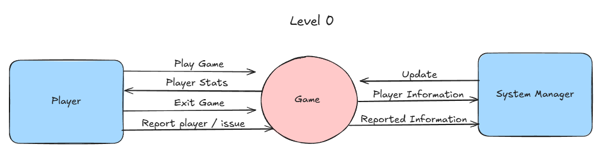

# 11 ASE Task 2 2025: The Object-Oriented Paradigm

#### By Erin Lee

# Sprint 1
## Requirements Definition
### Functional Requirements
- Users must be able to use their controller to select options and play games
- Program must be educational and help develop practical skills
- Provide users with correct information if their input is incorrect
- Create a clear user interface
- Program must update user's data frequently to provide a visualisation of their in-game items

### Non-functional Requirements
- System must be fast with no delays which can potentially effect users
- System must be checked frequently to allow data of the program to be reliable
- Program must be clear to visualise with thorough instructions 
- Program must be visually appealing and engaging
- Program must have high maintainability through creating an easy code structure and documentation for developers

## Determining Specifications
### Functional Specifications
- Users should be able to see the leaderboard 
- Program must be educational and provide users with a fun way to learn
- Allow users to provide feedback and allow exception handling to eliminate errors
- Users must be able to interact with the system through a graphical user interface
- System should convert user's input into outputs which can also be capable of displaying errors and correct answers

### Non-functional Specifications
- Make frequent updates to the program to allow the system to perform tasks efficiently
- Optimise code and algorithms to fully minimise complexity 
- Allow the interface to remain simple to eliminate the program from being unusable
- To prevent the whole system from crashing, make updates on specific parts of the system to save back-ups
- Focus on creating clear interface, making it easy to navigate and accept user control and feedback to improve UI usability

## Use Case 

## Design

### Storyboard

### Data Flow Diagram
#### Level 0

#### Level 1

## Build and Test

## Review
### 1. Evaluate how effectively your project meets the functional and non-functional requirements defined in your planning.
### Functional Requirements:
#### Users must be able to use their controller to select options and play games
✅ My code utilises numeric inputs to select game options and play games.
#### Program must be educational and help develop practical skills
✅ My program uses math operations like +, -, ×, ÷ to support a wide range of players with their math skills.
#### Provide users with correct information if their input is incorrect
✅ My program handles incorrect errors and invalid inputs and provides users with a solution or an answer.
#### Create a clear user interface
✅ My UI is simple and text based, using clear images, spacing, and heading to allow a easy visualisation.
#### Program must update user's data frequently to provide a visualisation of their in-game items
⚠️ My program partially does this as coins are updated and displayed after each question yet it isn't visualised.

### Non-Functional Requirements:
#### System must be fast with no delays which can potentially effect users
✅ My program runs instantly without any delays or lag.
#### System must be checked frequently to allow data of the program to be reliable
⚠️ My code handles errors and input validation yet there is no persistent data.
#### Program must be clear to visualise with thorough instructions 
✅ The help menu explains options clearly and even includes a system for reporting
#### Program must be visually appealing and engaging
⚠️ My program uses basic text UI so colour, animations, or sounds could be added for it to be more appealing.
#### Program must have high maintainability through creating an easy code structure and documentation for developers
✅ Class based structure with comments throughout the code allowing the code to be readable and easy to follow.

### 2. Analyse the performance of your program against the key use-cases you identified.
My program performs well against the main use-cases I identified during planning. One of the key goals was to create an educational game that helps users improve their maths skills in a fun way, and I achieved this by including randomised questions that match the player's year level. The use of different operations like addition, subtraction, multiplication, and division helps keep the game both challenging and age-appropriate. I also wanted users to be able to easily interact with the system, so I made a clear and simple menu that lets them choose between playing, viewing the leaderboard, or getting help. I added error handling to make sure the program doesn’t crash when a user types something wrong, which improves the overall experience. The leaderboard updates automatically based on the player’s score, which gives a clear sense of progress. Although I didn’t include a full graphical interface yet, the text-based layout still works well for now and meets the core goals I set for the project. I also want to include a player id and make it displayable so players can friend request each other, report with each other, play with each other and so on.

### 3. Assess the quality of your code in terms of readability, structure, and maintainability.
The quality of my code demonstrates a strong focus on readability, structure, and maintainability. I used clear and descriptive naming conventions for both classes and methods, which helps convey each component's purpose without needing extensive comments. The code follows an object oriented structure, separating concerns through the use of Player and Game classes, which makes the logic modular and easier to manage or expand in the future. Logical sections of the game like the leaderboard, help menu, and question generation—are broken into distinct methods, reducing redundancy and making the program easier to debug. I also implemented input validation and exception handling, which not only improves user experience but also makes the system more robust. Furthermore, by keeping functions relatively short and focused on single tasks, the code remains clean and easier for others (or myself later) to understand and maintain. Overall, the structure I used allows for future updates, such as integrating a graphical user interface, without needing to rewrite the entire codebase.

### 4. Explain the improvements that should be made in the next stage of development.
In the current stage of development, I structured my game to deliver an interactive and educational experience while focusing on core features and user engagement. I would like players to have a unique 8-digit numerical ID to help distinguish users easily and securely during gameplay. I also would like to build a functional coin system where users are rewarded for correct answers and penalized for incorrect ones, with the balance never dropping below zero. To ensure the game is age-appropriate and educational, I designed the difficulty of the questions to scale based on the player’s year level. I need to include input validation and error handling to help prevent crashes and provide a smoother experience for users. Additionally, I would like to improve on the sectioned designed to help users. Overall, the code is structured clearly, making it easy to navigate and maintain as the game evolves but a few areas of improvement was spotted.

# Sprint 2
## Design

### Structure Chart

### Algorithms
#### Flowcharts

#### Pseudocodes

## Build and Test

## Review
### 1. Evaluate how effectively your project meets the functional and non-functional requirements defined in your planning.
### Functional Requirements:
#### Users must be able to use their controller to select options and play games
✅ My code utilises numeric inputs to select game options and play games.
#### Program must be educational and help develop practical skills
✅ My program uses math operations like +, -, ×, ÷ to support a wide range of players with their math skills.
#### Provide users with correct information if their input is incorrect
✅ My program handles incorrect errors and invalid inputs and provides users with a solution or an answer.
#### Create a clear user interface
✅ My UI is simple and text based, using clear images, spacing, and heading to allow a easy visualisation.
#### Program must update user's data frequently to provide a visualisation of their in-game items
✅ My program partially does this as coins are updated and displayed after each question and it can be visualised when entering leaderboards.

### Non-Functional Requirements:
#### System must be fast with no delays which can potentially effect users
✅ My program runs instantly without any delays or lag.
#### System must be checked frequently to allow data of the program to be reliable
✅ My code handles errors and input validation with persistent data
#### Program must be clear to visualise with thorough instructions 
✅ The help menu explains options clearly and even includes a system for reporting
#### Program must be visually appealing and engaging
⚠️ My program uses basic text UI so colour, animations, or sounds could be added for it to be more appealing.
#### Program must have high maintainability through creating an easy code structure and documentation for developers
✅ Class based structure with comments throughout the code allowing the code to be readable and easy to follow.

### 2. Analyse the performance of your program against the key use-cases you identified.
My Puzzle Pals program performs reasonably well against several of its intended use-cases but still has areas that need some further development. The main menu navigation is functional, allowing users to choose between playing the game, accessing help, or exiting. The help menu is well-structured, offering reporting and placeholder sound controls, although the sound functionality is not yet implemented. The core gameplay currently supports Year 1 to Year 12 levels with personalised math questions based on year level and gives appropriate feedback for correct or incorrect answers. Although coin-adding and subtracting functions are defined, they are not actually used in the gameplay, meaning the currency system is not yet functional. Additionally, features like displaying the player ID and viewing the leaderboard are included in the structure but not implemented in the current code. Overall, while the foundation is solid and many key use-cases are partially met, the program needs further refinement and integration of missing logic to fully deliver its intended functionality.

### 3. Assess the quality of your code in terms of readability, structure, and maintainability.
I think the quality of my code is decent, but there are definitely areas I could improve. In terms of readability, I tried to keep things spaced out and used comments to explain what each part does, which helps make it easier to follow. However, some parts are repetitive, especially in the game section for different year levels, which makes it harder to maintain or update later. Structurally, I started with a good main menu and broke some parts into functions, but I didn’t fully use those functions throughout the whole program. For example, I made add_currency and subtract_currency functions, but I didn’t actually use them when updating coins, which defeats the purpose of having them. If I used more subroutines and cleaned up the repeated code, it would be easier to maintain and add new features in the future. Overall, I think my code works okay for now, but I need to organise it better to make it more professional and easier to improve later on.

### 4. Explain the improvements that should be made in the next stage of development.
In the next stage of development, one of my main priorities is improving the currency system so that coins are actually updated based on whether the player gets a question right or wrong. At the moment, the functions for adding and subtracting coins exist, but they aren’t being used properly. Another important step is cleaning up the repeated code by using more subroutines, which will make everything easier to update and maintain. Lastly, I need to finish features like the leaderboard, sound control settings, and displaying the player ID so that the game feels more complete and polished overall.

# Sprint 3
## Design

## Build and Test

## Review

## Launch

# Sprint 4
## Design

## Build and Test

## Review

## Launch