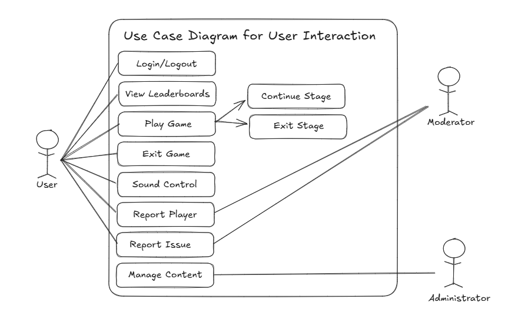
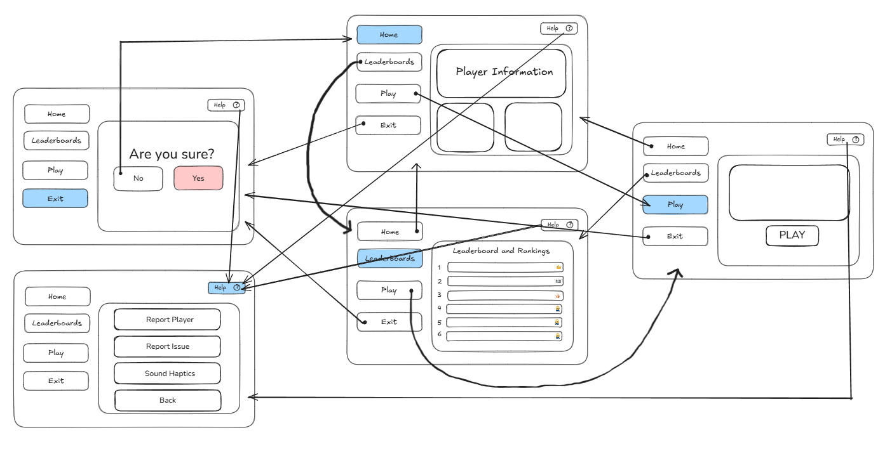

# 11 ASE Task 2 2025: The Object-Oriented Paradigm

#### By Erin Lee

# Sprint 1
## Requirements Definition
### Functional Requirements
- Users must be able to use their controller to select options and play games
- Program must be educational and help develop practical skills
- Provide users with correct information if their input is incorrect
- Create a clear user interface
- Program must update user's data frequently to provide a visualisation of their in-game items

### Non-functional Requirements
- System must be fast with no delays which can potentially effect users
- System must be checked frequently to allow data of the program to be reliable
- Program must be clear to visualise with thorough instructions 
- Program must be visually appealing and engaging
- Program must have high maintainability through creating an easy code structure and documentation for developers

## Determining Specifications
### Functional Specifications
- Users should be able to see the leaderboard 
- Program must be educational and provide users with a fun way to learn
- Allow users to provide feedback and allow exception handling to eliminate errors
- Users must be able to interact with the system through a graphical user interface
- System should convert user's input into outputs which can also be capable of displaying errors and correct answers

### Non-functional Specifications
- Make frequent updates to the program to allow the system to perform tasks efficiently
- Optimise code and algorithms to fully minimise complexity 
- Allow the interface to remain simple to eliminate the program from being unusable
- To prevent the whole system from crashing, make updates on specific parts of the system to save back-ups
- Focus on creating clear interface, making it easy to navigate and accept user control and feedback to improve UI usability

## Use Case 

## Design

### Storyboard

### Data Flow Diagram
(image)

## Build and Test
(add a code block or first build)

## Review
(sprint review questions and update git commits if required)

# Sprint 2

