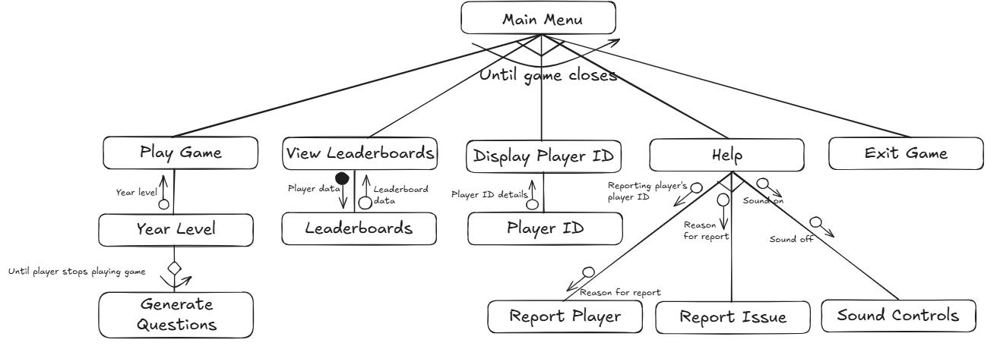

# 11 ASE Task 2 2025: The Object-Oriented Paradigm

#### By Erin Lee

# Sprint 1
## Requirements Definition
### Functional Requirements
- Users must be able to use their controller to select options and play games
- Program must be educational and help develop practical skills
- Provide users with correct information if their input is incorrect
- Create a clear user interface
- Program must update user's data frequently to provide a visualisation of their in-game items

### Non-functional Requirements
- System must be fast with no delays which can potentially effect users
- System must be checked frequently to allow data of the program to be reliable
- Program must be clear to visualise with thorough instructions 
- Program must be visually appealing and engaging
- Program must have high maintainability through creating an easy code structure and documentation for developers

## Determining Specifications
### Functional Specifications
- Users should be able to see the leaderboard 
- Program must be educational and provide users with a fun way to learn
- Allow users to provide feedback and allow exception handling to eliminate errors
- Users must be able to interact with the system through a graphical user interface
- System should convert user's input into outputs which can also be capable of displaying errors and correct answers

### Non-functional Specifications
- Make frequent updates to the program to allow the system to perform tasks efficiently
- Optimise code and algorithms to fully minimise complexity 
- Allow the interface to remain simple to eliminate the program from being unusable
- To prevent the whole system from crashing, make updates on specific parts of the system to save back-ups
- Focus on creating clear interface, making it easy to navigate and accept user control and feedback to improve UI usability

## Use Case 

## Design

### Storyboard

### Data Flow Diagram
#### Level 0

#### Level 1

## Build and Test

## Review
### 1. Evaluate how effectively your project meets the functional and non-functional requirements defined in your planning.
### Functional Requirements:
#### -Users must be able to use their controller to select options and play games
✅ My code utilises numeric inputs to select game options and play games.
#### -Program must be educational and help develop practical skills
✅ My program uses math operations like +, -, ×, ÷ to support a wide range of players with their math skills.
#### -Provide users with correct information if their input is incorrect
✅ My program handles incorrect errors and invalid inputs and provides users with a solution or an answer.
#### -Create a clear user interface
✅ My UI is simple and text based, using clear images, spacing, and heading to allow a easy visualisation.
#### -Program must update user's data frequently to provide a visualisation of their in-game items
⚠️ My program partially does this as coins are updated and displayed after each question yet it isn't visualised.

### Non-Functional Requirements:
#### -System must be fast with no delays which can potentially effect users
✅ My program runs instantly without any delays or lag.
#### -System must be checked frequently to allow data of the program to be reliable
⚠️ My code handles errors and input validation yet there is no persistent data.
#### -Program must be clear to visualise with thorough instructions 
✅ The help menu explains options clearly and even includes a system for reporting.
#### -Program must be visually appealing and engaging
⚠️ My program uses basic text UI so colour, animations, or sounds could be added for it to be more appealing.
#### -Program must have high maintainability through creating an easy code structure and documentation for developers
✅ Class based structure with comments throughout the code allowing the code to be readable and easy to follow.

### 2. Analyse the performance of your program against the key use-cases you identified.
My program performs well against the main use-cases I identified during planning. One of the key goals was to create an educational game that helps users improve their maths skills in a fun way, and I achieved this by including randomised questions that match the player's year level. The use of different operations like addition, subtraction, multiplication, and division helps keep the game both challenging and age-appropriate. I also wanted users to be able to easily interact with the system, so I made a clear and simple menu that lets them choose between playing, viewing the leaderboard, or getting help. I added error handling to make sure the program doesn’t crash when a user types something wrong, which improves the overall experience. The leaderboard updates automatically based on the player’s score, which gives a clear sense of progress. Although I didn’t include a full graphical interface yet, the text-based layout still works well for now and meets the core goals I set for the project. I also want to include a player id and make it displayable so players can friend request each other, report with each other, play with each other and so on.

### 3. Assess the quality of your code in terms of readability, structure, and maintainability.
The quality of my code demonstrates a strong focus on readability, structure, and maintainability. I used clear and descriptive naming conventions for both classes and methods, which helps convey each component's purpose without needing extensive comments. The code follows an object oriented structure, separating concerns through the use of Player and Game classes, which makes the logic modular and easier to manage or expand in the future. Logical sections of the game like the leaderboard, help menu, and question generation—are broken into distinct methods, reducing redundancy and making the program easier to debug. I also implemented input validation and exception handling, which not only improves user experience but also makes the system more robust. Furthermore, by keeping functions relatively short and focused on single tasks, the code remains clean and easier for others (or myself later) to understand and maintain. Overall, the structure I used allows for future updates, such as integrating a graphical user interface, without needing to rewrite the entire codebase.

### 4. Explain the improvements that should be made in the next stage of development.
In the current stage of development, I structured my game to deliver an interactive and educational experience while focusing on core features and user engagement. I would like players to have a unique 8-digit numerical ID to help distinguish users easily and securely during gameplay. I also would like to build a functional coin system where users are rewarded for correct answers and penalized for incorrect ones, with the balance never dropping below zero. To ensure the game is age-appropriate and educational, I designed the difficulty of the questions to scale based on the player’s year level. I need to include input validation and error handling to help prevent crashes and provide a smoother experience for users. Additionally, I would like to improve on the sectioned designed to help users. Overall, the code is structured clearly, making it easy to navigate and maintain as the game evolves but a few areas of improvement was spotted.

# Sprint 2
## Design

### Structure Chart

### Algorithms
#### Flowcharts
##### Mainline Routine

##### Subline Routine

##### Subline Routine

#### Pseudocodes
##### Mainline Routine

##### Subline Routine

##### Subline Routine

## Build and Test

## Review
### 1. Evaluate how effectively your project meets the functional and non-functional requirements defined in your planning.
### Functional Requirements:
#### -Users must be able to use their controller to select options and play games
✅ My code utilises numeric inputs to select game options and play games.
#### -Program must be educational and help develop practical skills
✅ My program uses math operations like +, -, ×, ÷ to support a wide range of players with their math skills, according to their yearl level.
#### -Provide users with correct information if their input is incorrect
✅ My program handles incorrect errors and invalid inputs and provides users with a solution or an answer.
#### -Create a clear user interface
✅ My UI is simple and text based, using clear images, spacing, and heading to allow a easy visualisation.
#### -Program must update user's data frequently to provide a visualisation of their in-game items
✅ My program is successful in upadting user's data (coins) as after every round of quiz, they are given their updated sum of coins. The leaderboard now correctly displays the right information. 

### Non-Functional Requirements:
#### -System must be fast with no delays which can potentially effect users
✅ My program runs instantly without any delays or lag.
#### -System must be checked frequently to allow data of the program to be reliable
✅ Data of the program will be reliable as system will be thoroughly checked and updates are less required.
#### -Program must be clear to visualise with thorough instructions 
✅ The help menu explains options clearly and even includes a system for reporting.
#### -Program must be visually appealing and engaging
⚠️ My program uses basic text UI so colour, animations, or sounds could be added for it to be more appealing.
#### -Program must have high maintainability through creating an easy code structure and documentation for developers
✅ Class based structure with comments throughout the code allowing the code to be readable and easy to follow.

### 2. Analyse the performance of your program against the key use-cases you identified.
My program now covers most of the use-cases I identified at the beginning of the project. However, I was still unable to make it visually appealing as the program still run by text UI. I made improvements from the first sprint as I added more components and set up classes. My program is yet unable to eliminate used player ids so there may be overlapping player ids among users. For the next sprint, I will put my focus to this and overall make the code better as I hace already defined classes. I was also unsuccessful in creating user interactions where users can communicate with other users as this will require more checking so I will include it if I am able to. 

### 3. Assess the quality of your code in terms of readability, structure, and maintainability.
My code is easy to visualise as I have included comments for every step I took even the smaller details. It is structured well with all the correct indentations. Additionally, the code is readable as it is overall simple to understand and it goes down step by step, allowing clear and enhanced visualisation. My program has low maintanence as right now, there are no user interactions, making it require less frequent updates and fixes. It has no delays or bugs so regular check-ups may be required yet, it shouldn't be as frequent compared to other programs.

### 4. Explain the improvements that should be made in the next stage of development.
For the next stage of improvement, I would want to focus on improving the minor details as I have already created classes in sprint 2. What I would be mostly working on will be improving player IDs as currently, the IDs of users might overlap. After I am done with this, I will move onto the aesthetics. 

# Sprint 3
## Design
#### UML Class Diagram

## Build and Test

## Review
### 1. Evaluate how effectively your project meets the functional and non-functional requirements defined in your planning.
### Functional Requirements:
#### -Users must be able to use their controller to select options and play games
✅ My code utilises numeric inputs to select game options and play games.
#### -Program must be educational and help develop practical skills
✅ My program uses math operations like +, -, ×, ÷ to support a wide range of players with their math skills, according to their yearl level.
#### -Provide users with correct information if their input is incorrect
✅ My program handles incorrect errors and invalid inputs and provides users with a solution or an answer.
#### -Create a clear user interface
✅ My UI is simple and text based, using clear images, spacing, and heading to allow a easy visualisation.
#### -Program must update user's data frequently to provide a visualisation of their in-game items
✅ My program is successful in upadting user's data (coins) as after every round of quiz, they are given their updated sum of coins. The leaderboard now correctly displays the right information. 

### Non-Functional Requirements:
#### -System must be fast with no delays which can potentially effect users
✅ My program runs instantly without any delays or lag.
#### -System must be checked frequently to allow data of the program to be reliable
✅ Data of the program will be reliable as system will be thoroughly checked and updates are less required.
#### -Program must be clear to visualise with thorough instructions 
✅ The help menu explains options clearly and even includes a system for reporting.
#### -Program must be visually appealing and engaging
⚠️ My program uses basic text UI so colour, animations, or sounds could be added for it to be more appealing.
#### -Program must have high maintainability through creating an easy code structure and documentation for developers
✅ Class based structure with comments throughout the code allowing the code to be readable and easy to follow.

### 2. Analyse the performance of your program against the key use-cases you identified.
My program covers all the use-cases I have identified apart from one which is improving the aesthetics of the game. I have created my code to be able to eliminate player IDs which are already in use and allowed the program to give the player an ID which is different to any other IDs in the game, making everyone's player ID unique. For my last sprint, I will focus on the aesthetics.

### 3. Assess the quality of your code in terms of readability, structure, and maintainability.
My program has a perfect readability, structure, and maintainability as I have divided the codes up into smaller chunks and added comments on each of the process I took to complete it. My code is also fairly simple, allowing a clearer visualisation of the code and again, my code is highly maintainable as there are no interactions between players, allowing a less frequent check-up on the program and less fixes for bugs. My code so far runs almost immediately with no lags so it will be quite easy to maintain the program. The layout of my code is easy to read as I have structured it well with only the necessary components and it is simplified as much as it could be.

### 4. Explain the improvements that should be made in the next stage of development.
In the next stage of development, I will put my focus on making the program aesthetic as it is still currently run by basic text UI. I would like to us tkinter to create an entire pop-up for my game.

# Sprint 4
## Design
### Potential Improvements
#### Identify Potential Enhancements:
- Adaptive Difficulty- Adjust the question difficulty according to the player's performance
- Timed Difficulty- Add a time limit to increase difficulty or create a new mode within the game
- Teacher Mode- Add a separate mode for teachers to be able to set custom questions or monitor their students
- Multiplayer mode- Allow 2 or more players to get into a game at the same time to see who answers the most amount of questions

#### Explain the Integration Process:
To integrate these new features into Puzzle Pals, I would start by planning each enhancement as a separate module or subroutine to keep the code organised and easy to manage.

For Adaptive Difficulty, I would create a performance tracker that records the number of correct and incorrect answers. Based on the player’s recent accuracy, the question generator would automatically adjust the range of numbers and the complexity of the operations (e.g., introducing harder operators or multi-step questions if the player is doing well).

For Timed Difficulty, I would use a timer function (like time.time() in Python) to measure how long the player takes to answer each question. I could then add a countdown timer on screen, where players must answer within a certain number of seconds or they lose coins or the question is skipped. This could also be introduced as a separate timed game mode in the main menu.

To build Teacher Mode, I would add a new menu option that allows teachers to log in with a code or ID. Once inside, they could enter custom questions, view stored player performance data, or select which year levels the questions apply to. I would also need a way to store and load this data, using files or simple databases.

For Multiplayer Mode, I would allow two or more users to enter their names and take turns answering questions. I would use a scoreboard to track each player’s performance and display results at the end of the round. To keep the gameplay fair, both players could be given the same or similar questions and equal time to answer.

Each of these features would be tested separately before fully integrating into the main menu, ensuring they don’t break existing functionality. I would also keep my code modular by placing each feature in its own function or class to maintain readability and make future updates easier.

#### Updated Structure Chart
(Update Structure Chart / Class Diagram as Required)

## Build and Test

## Review

## Launch